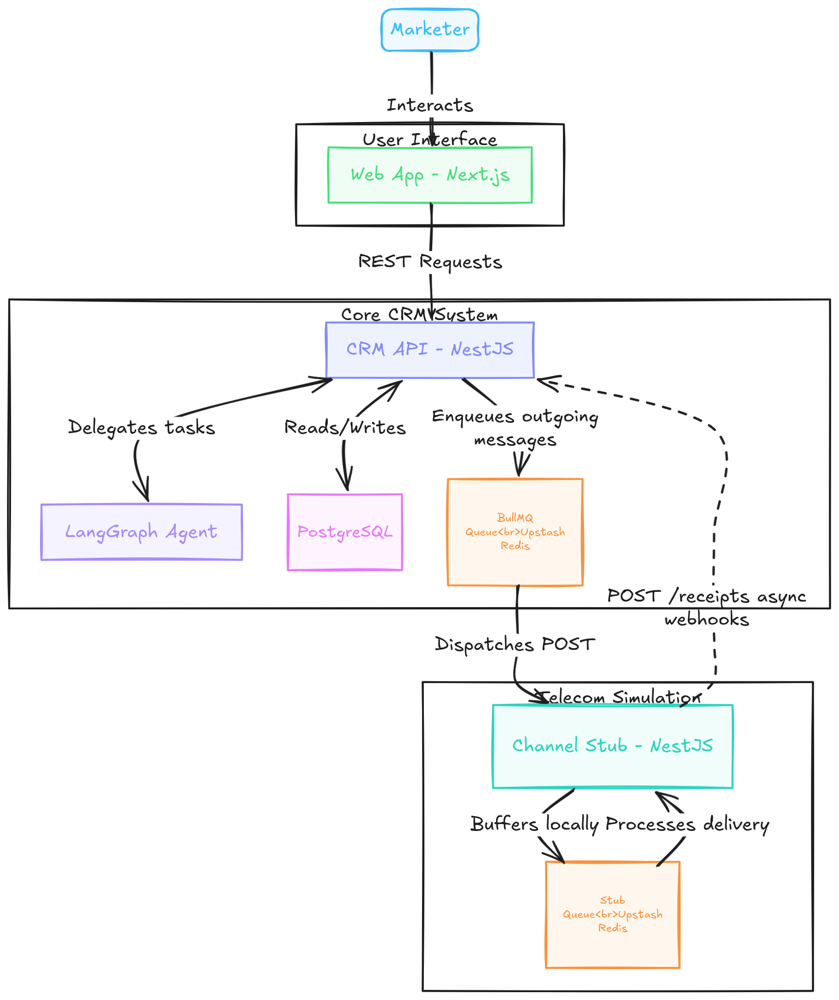

# BrewCRM: AI-Native Mini CRM

An AI-native CRM built for the [**Xeno Engineering Take-Home Assignment**](./Xeno%20Engineering%20Internship%20Assignment%20-%202026-1.pdf). 
BrewCRM is designed for a fictional specialty coffee chain ("Roast & Co.") to help marketers intelligently reach their shoppers through personalized, data-driven campaigns via a chat-first experience.

## 🔗 Live Demo
[brewcrm.your-domain.com](https://your-url) · [Backend API](https://api-url)

## 🎯 The Challenge & Approach

The assignment required building a system to ingest data, segment shoppers, send personalized communications, and track performance using a stubbed channel service—all while being deeply "AI-native."

Instead of bolting an AI chatbot onto a traditional SaaS interface, **BrewCRM is built as a true AI agent (Co-pilot).** The marketer describes their intent in natural language (e.g., *"Send a WhatsApp thank you message to my top 5 most loyal customers"*), and the AI autonomously handles the data querying, segmentation, copywriting, reach estimation, and campaign launch.

## ✨ Features

1. **Data Ingestion & Modeling**
   - Pre-seeded with 500 realistic customers and their purchase histories (orders, total spent, last order dates, preferred channels).
2. **AI-Native Segmentation**
   - The AI uses a `build_segment` tool to dynamically carve out audiences based on behavior (e.g., `totalOrders >= 5`, `daysSinceLastOrder <= 30`).
3. **Personalized Communications**
   - The AI drafts channel-specific copy (WhatsApp, Email, SMS) using template variables (`{{customer.name}}`, `{{customer.totalSpent}}`).
   - The backend personalizes the template for each recipient at launch time.
4. **Channel Service & Asynchronous Callbacks (The Loop)**
   - **Crucial Requirement:** A completely standalone microservice (`channel-stub`) simulates the messaging network.
   - The CRM enqueues BullMQ jobs to send messages to the stub.
   - The stub asynchronously processes deliveries with realistic delays and randomly simulates engagement outcomes.
   - The stub fires webhooks back to the CRM's `/receipts` API (Delivered, Opened, Clicked, Ordered, Failed).
5. **Performance Insights**
   - The CRM ingests receipt callbacks and updates campaign analytics in real-time.
   - The frontend visualizes this data as a live conversion funnel.

## 🏗️ Technical Architecture

The project is structured as a monorepo containing three main applications:

- **Frontend (`apps/web`)**: Next.js 14, Tailwind CSS, shadcn/ui. Features a modern, chat-first interface and real-time campaign tracking dashboards.
- **CRM API (`apps/crm-api`)**: NestJS backend powered by PostgreSQL (TypeORM). Hosts the LangGraph agent, manages the database, and exposes the `/receipts` webhook endpoint.
- **Channel Stub (`apps/channel-stub`)**: A separate NestJS microservice that acts as the mock telecommunications provider. It receives `POST /send` requests and processes delivery simulations via its own Redis queue.

### Infrastructure & Tooling
- **AI Engine**: LangGraph + Google Gemini (via `@langchain/google-genai`). The agent uses ReAct methodology with 5 custom tools (`query_customers`, `build_segment`, `draft_message`, `estimate_reach`, `launch_campaign`).
- **Queues**: BullMQ + Upstash Redis for handling high-volume message dispatching and asynchronous delivery simulations without blocking the main event loops.
- **Database**: PostgreSQL (Supabase) for relational data integrity.

## 🤖 The AI-Native Workflow

The AI Co-pilot doesn't just generate text; it acts as an orchestration layer over the CRM's business logic. 

1. **Understand & Query**: The agent translates natural language into a structured query using `query_customers` (with SQL-level sorting and limits to prevent loading massive datasets into memory).
2. **Segment**: It uses `build_segment` to save the targeted audience in the database.
3. **Draft**: It invokes `draft_message` to generate contextual, channel-optimized copy.
4. **Estimate**: It calls `estimate_reach` to provide the marketer with expected delivery and open rates based on historical channel performance.
5. **Human-in-the-Loop Execution**: The agent presents the complete campaign plan to the marketer. Upon explicit confirmation, it invokes `launch_campaign` to dispatch the jobs to BullMQ.

## 🚦 System Design Tradeoffs

- **Queue Separation**: Both the CRM and the Channel Stub have their own isolated BullMQ queues. This ensures that if the channel provider experiences latency or goes down, the CRM's outbound queue safely buffers the outgoing messages.
- **Callback Retries**: The `channel-stub` implements exponential backoff when hitting the CRM's receipt API to ensure no analytics events are lost due to transient network failures.
- **AI Rate Limiting**: The system limits sample sizes sent to the LLM context window to prevent token overflow while maintaining accurate segmentation via backend SQL execution.

## 🚫 Conscious Scope Decisions
- No auth/login — out of scope for a demo CRM
- No multi-tenancy — single brand (Roast & Co.) by design
- No real messaging provider — channel stub models the full async lifecycle
- No mobile responsive design — marketers use desktop
